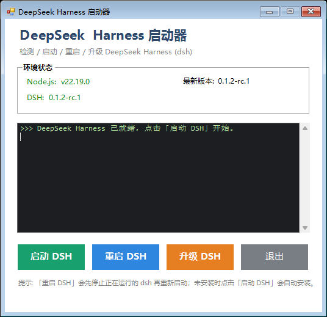

# DeepSeek Harness 启动器 (dsh-launcher)

Windows 桌面启动器，用于检测、启动、重启、升级、重装和自动安装 [DeepSeek Harness](https://www.deepseek.com/harness/) (dsh)。纯 PowerShell + WinForms 实现，绿色免安装，无额外运行时依赖（除 Node.js）。

## 界面预览



> 如果 GitHub 页面仍然看不到截图，请确认你已将 `docs/screenshot.png` 一起提交并推送到当前 README 所在的分支。图片文件已经放在本仓库中，README 使用的是仓库内的相对路径。

## 功能特性

- **一键启动**：在独立窗口启动 dsh web 服务
- **一键重启**：先停止正在运行的 dsh，再重新启动（三层停止机制，保证端口释放、无残留进程）
- **一键升级**：显式版本 + `--prefer-online` + 安装后版本校验，避免 npm 路径不一致导致的"假升级"
- **一键重装**：可选择强制覆盖安装，或卸载全局 npm 包后再安装最新版；不会删除用户配置
- **自动安装**：未检测到 dsh 时自动提示，并通过 `npm install -g` 安装
- **环境自检**：启动时自动检测 Node.js / dsh / npm 最新版本；Node 版本不满足要求时给出明确提示
- **执行提示**：安装、升级、启动、重启和停止过程显示当前动作、等待提示和异常结果

## 环境要求

| 依赖 | 要求 | 说明 |
| --- | --- | --- |
| Windows | 10 / 11 | 需 PowerShell 5.1（系统自带） |
| Node.js | ≥ v22.19 | DeepSeek Harness 的硬性要求 |
| dsh | 最新版 | npm 全局包 `@deepseek-ai/dsh` |

## 安装与使用

### 推荐下载方式：GitHub Releases

1. 打开项目的 [Releases 页面](https://github.com/felix-he/dsh-launcher/releases)。
2. 点击最新版本下方的 `dsh-launcher-v版本号.zip` 下载文件。
3. 右键 ZIP 文件，选择 **全部解压缩**，再打开解压出来的文件夹。
4. 双击 `CreateDesktopShortcut.cmd` 创建桌面快捷方式。

> 不建议直接下载 GitHub 页面上的 **Source code (zip)**。请下载 Release 下方带有 `dsh-launcher-` 名称的 ZIP 文件。

### 第一次使用：一键创建桌面快捷方式

1. 如果你已经下载了 Release ZIP，请直接进入下一步。
2. 如果暂时没有 Release，也可以在 GitHub 项目页面点击 **Code → Download ZIP**，下载项目压缩包。
3. 找到下载的 ZIP 文件，右键选择 **全部解压缩**，再打开解压出来的文件夹。
4. 双击 `CreateDesktopShortcut.cmd`。如果 Windows 弹出安全提示，请点击 **打开**。
5. 看到“Desktop shortcut created”提示后，桌面上会出现 **DSH Launcher** 快捷方式。
6. 以后只需要双击桌面的 **DSH Launcher**，即可打开启动器界面。

脚本会自动找到 `scripts` 文件夹里的启动器脚本，并自动处理 PowerShell 执行策略，不需要手动输入命令。

### 直接运行（给熟悉 PowerShell 的用户）

也可以在 PowerShell 中运行下面的命令。请将路径换成实际的项目文件夹路径：

```powershell
powershell.exe -NoProfile -ExecutionPolicy Bypass -File "D:\tools\dsh-launcher\scripts\CreateDesktopShortcut.ps1"
```

### 首次启动 DSH

1. 确认电脑已安装 Node.js v22.19 或更高版本。没有安装时，请先访问 [Node.js 官网](https://nodejs.org/) 安装 **LTS** 版本。
2. 双击桌面的 **DSH Launcher**。
3. 点击 **启动 DSH**。如果还没有安装 DeepSeek Harness，程序会询问是否自动安装，请点击 **Yes**。
4. 安装完成后，程序会打开 dsh web 窗口。保持该窗口打开即可使用服务。

> 安装或升级期间请保持启动器打开。独立的 dsh PowerShell 窗口会显示启动状态；服务运行期间请保持该窗口打开，关闭它会停止 DSH。

> 不要直接双击 `scripts\DSHLauncher.ps1` 或 `scripts\CreateDesktopShortcut.ps1`。请使用桌面快捷方式，或先双击根目录的 `CreateDesktopShortcut.cmd` 创建快捷方式。

> 提示：脚本文件必须保持 **UTF-8 with BOM** 编码——Windows PowerShell 5.1 会按 ANSI 解析无 BOM 文件，导致中文乱码和语法错误。

## 按钮说明

| 按钮 | 功能 |
| --- | --- |
| 启动 DSH | 启动 dsh web；未安装时自动提示并安装 |
| 重启 DSH | 停止当前 dsh 后重新启动 |
| 升级 DSH | 升级到 npm 最新版本，完成后校验版本 |
| 重装 DSH | 选择强制覆盖安装，或卸载全局包后再安装最新版；保留 `.dsh` profile、插件和配置 |
| 退出 | 停止已启动的 dsh 后关闭启动器 |

## 工作原理

- **启动**：通过 `powershell -EncodedCommand` 在独立窗口运行 dsh web，窗口标题设为 `dsh web (DSH Launcher)`，并记录窗口进程 PID 到 `dsh.pid`（已 gitignore）；
- **停止（三层保障）**：
  1. 按唯一窗口标题发送窗口关闭消息（等同点击窗口 X，dsh 可优雅退出）；
  2. 若未退出，`taskkill /T /F` 结束进程树；
  3. 按命令行特征 `@deepseek-ai\dsh` 清扫残留 node 进程，确保端口 3080 释放；
- **升级**：读取 npm 最新版本 → 显式指定 `@deepseek-ai/dsh@<版本>` + `--prefer-online` 安装 → 按 npm 全局前缀重新探测 dsh 并校验实际版本；若版本未变化，提示检查 npm 前缀和命令路径。
- **重装**：可执行 `npm install -g --force --prefer-online @deepseek-ai/dsh@latest`，或先执行 `npm uninstall -g @deepseek-ai/dsh` 再安装最新版；两种方式只处理全局 npm 包，不删除 `%USERPROFILE%\\.dsh` 下的 profile、插件和配置，完成后不会自动启动 DSH。
- **执行提示**：启动器会显示安装、升级、重启和停止的阶段性日志；npm 输出会在后台任务运行期间逐步显示。独立 dsh 窗口会提示启动、运行注意事项和退出码。

## 项目结构

```
dsh-launcher/
├── CreateDesktopShortcut.cmd  # 双击即可创建桌面快捷方式
├── scripts/
│   ├── DSHLauncher.ps1   # 启动器主脚本（GUI）
│   └── CreateDesktopShortcut.ps1   # 创建快捷方式的 PowerShell 脚本
├── docs/screenshot.png         # GitHub README 截图
├── .github/workflows/release.yml # 自动生成 GitHub Release ZIP
├── .gitignore        # 忽略运行时状态文件
└── README.md         # 项目说明
```

## 常见问题

### 升级显示成功但版本没变？
如果 npm 使用的全局安装前缀与 PATH 中优先找到的 `dsh.cmd` 不一致，npm 可能已经升级成功，但启动器仍会读取旧副本。启动器会按 npm 的实际全局前缀定位 dsh；如果仍有问题，请在 PowerShell 中检查：

```powershell
npm config get prefix
npm list -g @deepseek-ai/dsh --depth=0
where.exe dsh
```

### 启动时报 Node.js 版本过低？
DeepSeek Harness 要求 Node.js ≥ v22.19，请升级 Node.js 后重试。

### 新版本启动时报 `unsupported Harness subagent contract` 或 `webServer without inject`？
这通常是旧版第三方插件与新版本 DSH 不兼容，而不是启动器窗口问题。请在 PowerShell 中执行以下命令，重建 web profile 依赖并移除已知不兼容的 loopx 插件：

```powershell
$profile = "$env:USERPROFILE\.dsh\profiles\web"
pnpm --dir $profile install --force
pnpm --dir $profile add -w @nanmicoder/dsh-agent-teams@0.1.17-rc.1 --save-exact
pnpm --dir $profile remove -w dsh-loopx-plugin
```

然后编辑 `$profile\package.json`，从 `dsh.profile.bundles` 中删除 `dsh-loopx-plugin`，再重新点击「启动 DSH」。如果窗口中显示 `dsh web: http://127.0.0.1:3080/`，说明服务已正常启动。

### 脚本中文乱码？
脚本文件必须为 UTF-8 with BOM 编码，否则 Windows PowerShell 5.1 解析会出现乱码导致语法错误。

### 直接运行 .ps1 被阻止？
执行策略限制所致：双击 `CreateDesktopShortcut.cmd` 创建快捷方式即可。快捷方式已经带有 `-ExecutionPolicy Bypass`，不需要修改系统设置。

### 双击创建脚本没有反应？

请确认你双击的是根目录的 `CreateDesktopShortcut.cmd`，而不是 `scripts` 文件夹里的 PowerShell 脚本，并确认 `scripts\CreateDesktopShortcut.ps1` 和 `scripts\DSHLauncher.ps1` 都存在。如果仍然失败，请右键 `CreateDesktopShortcut.cmd`，选择 **以管理员身份运行** 后重试。

## 发布新版本（项目维护者）

1. 在本地修改代码并提交到 `main`。
2. 创建版本标签，例如：`git tag v1.0.0`。
3. 推送标签：`git push origin v1.0.0`。
4. 打开 GitHub 的 **Actions** 页面，等待 **Build GitHub Release** 完成。
5. 在 **Releases** 页面确认已生成 ZIP 附件。

以后每次推送以 `v` 开头的标签，GitHub 都会自动创建一个新的 Release，并附带可下载的 ZIP 文件。

## 许可证

[MIT](LICENSE)
